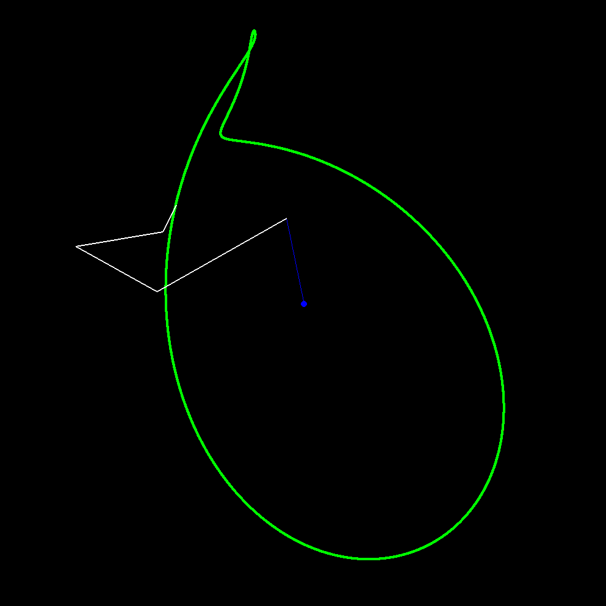
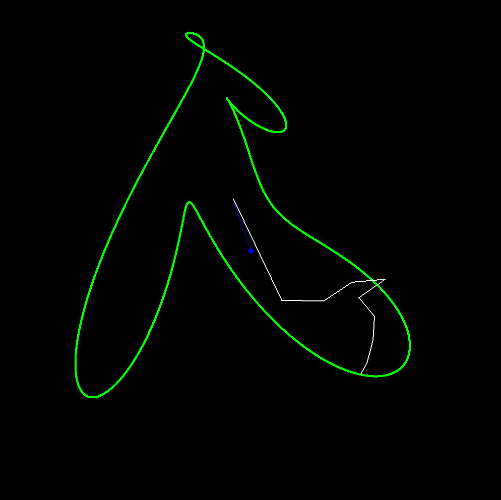
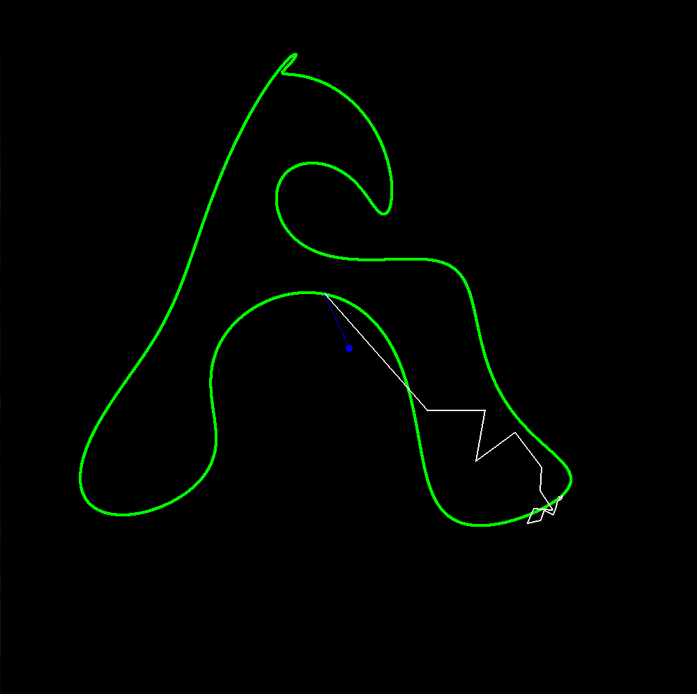
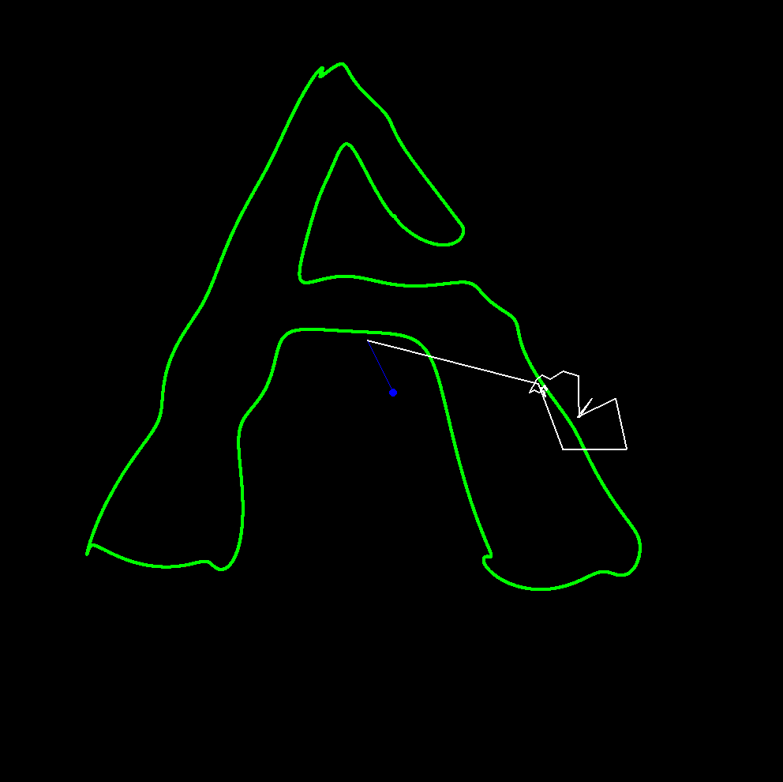
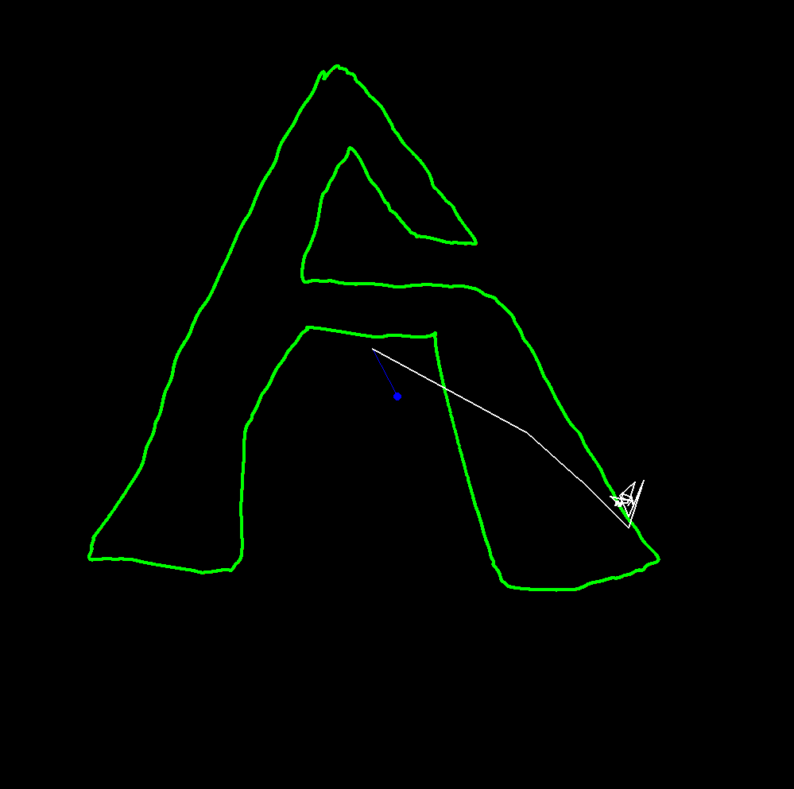

# ComplexFourier

## 1) Draw a Patern
Run `getdata.py` and try to draw a shape (easy or hard).
Your shape will be saved in `data.txt`.

## 2) Run Fourier
In `draw.py` set var N to a small number like 5 and run.
Then increase N to a bigger number and run again.
You should see better and better function in bigger Ns.
Keep N smaller than 1000 for performance issues.

## Screenshots

## License
- MIT
